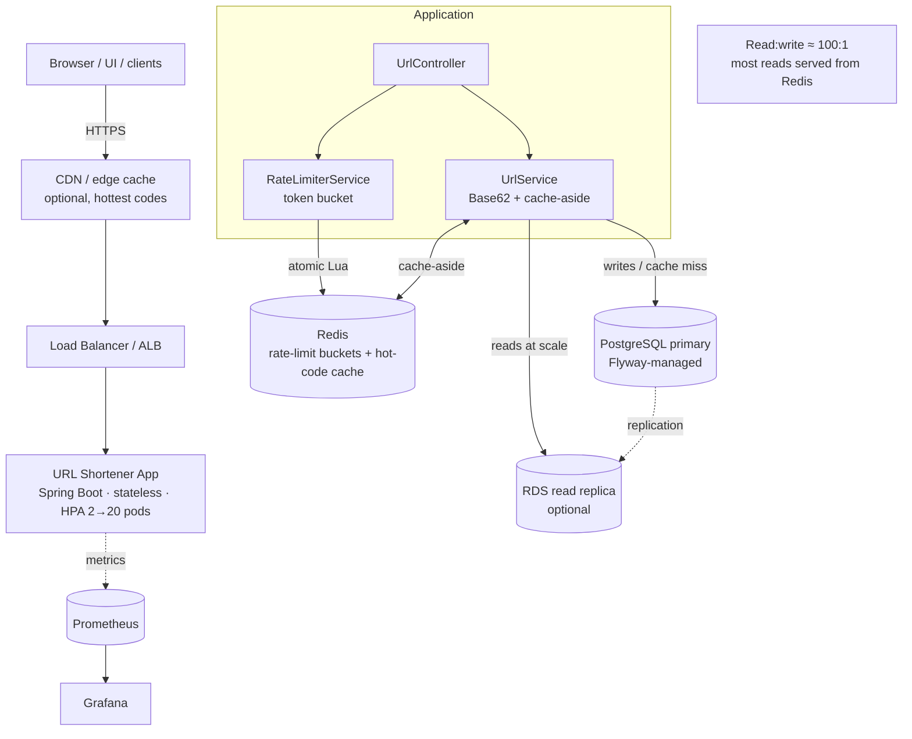
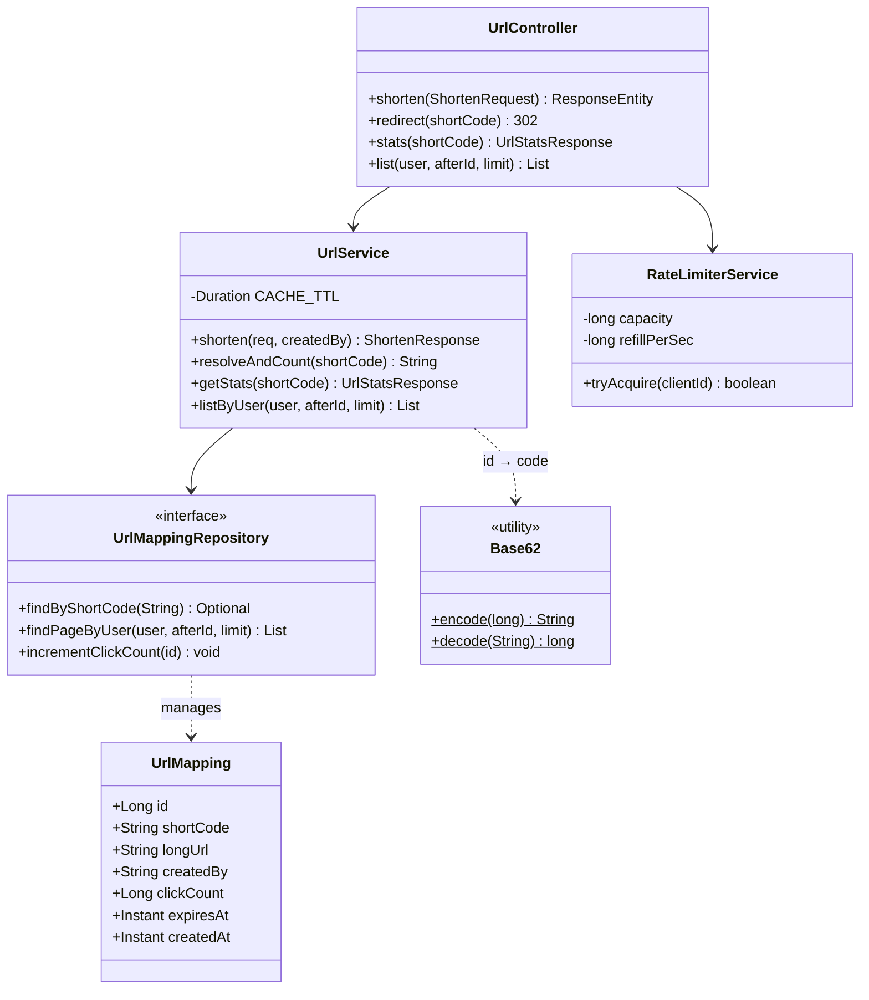
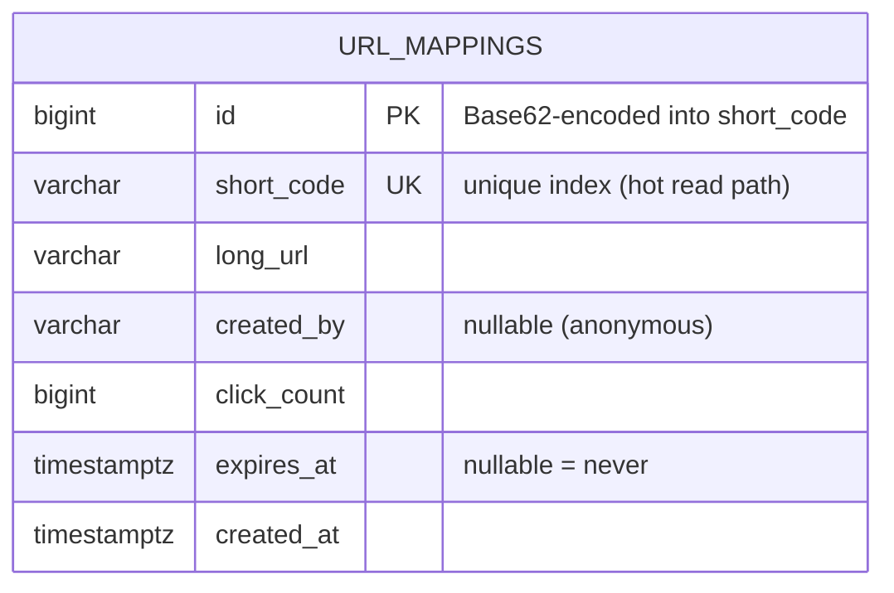
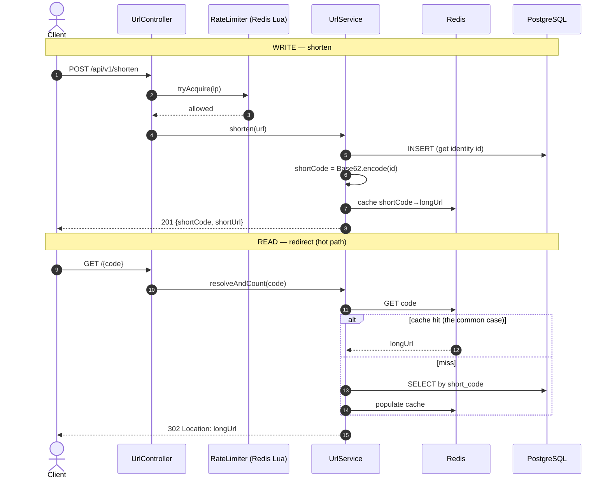

# URL Shortener — Diagrams

Diagrams for the URL shortener: the class model (`UrlService`, `RateLimiterService`,
`UrlMapping`), the schema, and the read-vs-write flow.

- [1. High-Level Design (HLD)](#1-high-level-design-hld)
- [2. UML Class Diagram](#2-uml-class-diagram)
- [3. Entity-Relationship Diagram](#3-entity-relationship-diagram)
- [4. Read vs Write Flow](#4-read-vs-write-flow)

---

## 1. High-Level Design (HLD)

---

## 2. UML Class Diagram

---

## 3. Entity-Relationship Diagram

Single-table design (deliberately) — the mapping is a self-contained key→value record.

---

## 4. Read vs Write Flow

