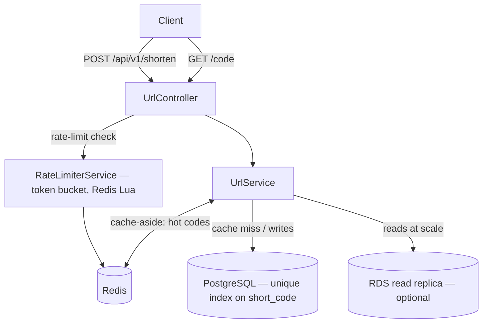

# URL Shortener / Rate-Limiter Service

A bit.ly-style URL shortener built around the read-heavy redirect path.
Java 21 · Spring Boot 3 · PostgreSQL · Redis · Docker · Kubernetes · AWS (Terraform).


---

## What it does

| Endpoint | Method | Purpose |
|---|---|---|
| `/api/v1/shorten` | POST | Create a short code for a long URL (optional custom alias, TTL) |
| `/{shortCode}` | GET | 302-redirect to the long URL (the read-heavy hot path) |
| `/api/v1/urls/{shortCode}` | GET | Click stats for a code |
| `/api/v1/urls?user=&afterId=&limit=` | GET | List a user's URLs (keyset pagination) |
| `/swagger-ui.html` | GET | Interactive API docs |
| `/actuator/health` | GET | Liveness/readiness for Docker & K8s |

---

**More diagrams:** UML class, ER, and read-vs-write sequence → [DIAGRAMS.md](DIAGRAMS.md)

## Architecture



- **Writes** (`shorten`) → primary Postgres; **reads** (`GET /{code}`) → Redis first,
  then the read replica on a miss.
- **Rate limiting** and **hot-code cache** both live in Redis; the app is stateless so it
  scales horizontally behind a load balancer.

### Key design decisions

**1. Base62 encoding of a DB identity ID** — [`Base62.java`](src/main/java/com/umang/urlshortener/util/Base62.java)
The short code is `Base62.encode(id)` where `id` is the auto-increment primary key.
Because IDs are unique by construction, codes never collide — no "is this code taken?"
check on insert. 7 chars = 62⁷ ≈ 3.5 trillion URLs.
*Trade-off:* sequential codes are enumerable; mitigations include starting the ID
sequence at a large offset, or salting/shuffling the ID space.

**2. Cache-aside with Redis** — reads dominate (~100:1) in a shortener. The redirect
path checks Redis first and only falls back to Postgres on a miss (then populates the
cache), so the URL lookup stays off the database on the common path.

**3. 302, not 301, on redirect** — a 301 is cached by browsers/proxies, so repeat clicks
would never reach the server and the click counter would under-count. Returning 302 keeps
every click flowing through the redirect path. (301 is the choice if you don't need
per-click analytics and want the browser cache to absorb the traffic.)

**4. Distributed token-bucket rate limiter** — [`RateLimiterService.java`](src/main/java/com/umang/urlshortener/service/RateLimiterService.java)
An atomic Redis Lua script runs the read-refill-decrement as one indivisible operation,
so concurrent requests across instances can't race. Token bucket (not fixed window)
allows bursts while capping the sustained rate.

**5. Keyset pagination** — `GET /api/v1/urls` lists a user's URLs with
`WHERE created_by = ? AND id < :cursor ORDER BY id DESC` instead of `OFFSET`, so deep
pages stay O(page size) rather than degrading as the offset grows.

---

## SQL vs NoSQL — why PostgreSQL here

| Factor | This project's choice |
|---|---|
| **Access pattern** | Simple key→value lookups (code→URL) *plus* relational queries (per-user listing, analytics). |
| **Consistency** | A newly created short code must be immediately resolvable — strong consistency wanted. |
| **Scale** | Single-region, moderate write volume. Postgres with a Redis read cache handles this comfortably. |
| **Decision** | **PostgreSQL** (source of truth) **+ Redis** (read cache & rate limiting). |

**When I'd switch to NoSQL:** at global, write-heavy scale (billions of URLs, multi-region),
a DynamoDB-style store keyed on `short_code` gives horizontal write scaling and single-digit-ms
lookups without managing shards manually. The relational listing/analytics would then move to a
separate analytics store. For this project's scale, Postgres+Redis is simpler and strongly consistent.

---

## Run it locally

**Prerequisites:** JDK 21 (Temurin or Corretto) — build/tests need JDK 21 (Mockito breaks
on JDK 25) · Maven · Docker Desktop (for Postgres + Redis).

```bash
git clone https://github.com/guptaumang769/url-shortener.git
cd url-shortener

docker compose up -d          # compose starts postgres + redis
mvn spring-boot:run           # app on :8080

curl localhost:8080/actuator/health   # → {"status":"UP"}

# Shorten
curl -s -XPOST localhost:8080/api/v1/shorten \
  -H 'Content-Type: application/json' \
  -d '{"url":"https://example.com/a/very/long/path"}'
# → {"shortCode":"1","shortUrl":"http://localhost:8080/1", ...}

# Redirect
curl -i localhost:8080/1      # 302 Location: https://example.com/...
```

**Run without Docker:** start just the datastores (`docker compose up -d postgres redis`,
or point `application.yml` at your own) and run the app from your IDE with a JDK 21 SDK.

---

## Tests

```bash
mvn test        # fast unit tests (Base62) — no Docker
mvn verify      # + Testcontainers integration tests (needs Docker running)
```

> **JDK 21 for tests.** Mockito breaks on JDK 25, so point `JAVA_HOME` at a JDK 21.
> macOS/Linux: `JAVA_HOME=$(/usr/libexec/java_home -v 21) mvn test`.
> Windows (PowerShell): `$env:JAVA_HOME="C:\Program Files\Eclipse Adoptium\jdk-21"; mvn test`.

- `Base62Test` — encode/decode identity, collision-free across a 100k-ID sweep, edge cases
- `UrlShortenerIT` — shorten→resolve, custom-alias conflict, expiry, click counting,
  keyset listing, and rate-limit drain against real Postgres + Redis

---

## Load test (k6)

With the app running, the script seeds a code itself and hammers the redirect:

```bash
k6 run loadtest/redirect-load.js
```
Thresholds enforced: **p99 < 50 ms**, error rate **< 1%** on the redirect path.

> _Record your actual numbers here after running, e.g._
> `200 VUs · 45k requests · p95 8ms · p99 21ms · 0.00% errors`

---

## Deploy

- **Docker:** `docker build -t url-shortener .`
- **Kubernetes:** `kubectl apply -f k8s/app.yaml` (Deployment + Service + HPA + Ingress)
- **AWS:** `terraform -chdir=terraform apply` provisions VPC (public/private subnets),
  RDS Postgres (+ optional read replica), ElastiCache Redis, ECR, and an ECS Fargate
  service behind an ALB.

Remember to `terraform destroy` when you're done — RDS/NAT/ALB bill hourly.

---

## How this scales to high throughput

A URL shortener is read-heavy (~100:1 reads:writes), so the design scales the read path
horizontally. The redirect (`GET /{code}`) is a key→value lookup — that's what's optimized.

1. **Stateless app → horizontal scale.** No session/local state, so N identical pods run
   behind a load balancer. The [HPA](k8s/app.yaml) scales 2→20 pods on CPU; there's no
   coordination between pods.
2. **Redis cache-aside absorbs the URL lookups.** Hot codes resolve from Redis in
   `UrlService`, so most redirects don't read Postgres for the URL. Cache hit ratio is the
   biggest throughput lever. (Click counting still does one indexed UPDATE per redirect —
   see the batched-counter note below.)
3. **Read replica provisioned for scale-out.** The [Terraform](terraform/data.tf) can
   stand up an RDS **read replica** (`enable_read_replica=true`) so reads scale
   independently of writes; wiring the app's read/write datasource split is the next step.
4. **Tuned connection pool.** HikariCP is sized small-per-pod (see `application.yml`) so
   20 pods don't exhaust Postgres connections; a PgBouncer would front RDS in production.
5. **Collision-free IDs = cheap writes.** Base62-of-identity means inserts need no
   read-before-write check — one INSERT per shorten.

**Next steps beyond this repo:**
- **Batch click counts** through a Redis `INCR` counter flushed periodically, so the hot
  path writes zero rows to Postgres per redirect.
- Front Postgres with **PgBouncer** and pre-allocate ID ranges per instance (a
  counter/ticket server, or Snowflake-style block allocation) to avoid sequence contention.
- At global scale, **shard by short-code hash** or move the mapping to a partitioned store
  (DynamoDB keyed on `short_code`), keeping Postgres for analytics only.
- Front redirects with a **CDN**/edge cache for the hottest codes.

**Measured throughput.** Run the [k6 load test](loadtest/redirect-load.js) and record the
numbers here:

```
# From your own run (k6 run loadtest/redirect-load.js):
# e.g.  200 VUs · 45,000 requests · p95 8ms · p99 21ms · 0.00% errors (single instance)
```
